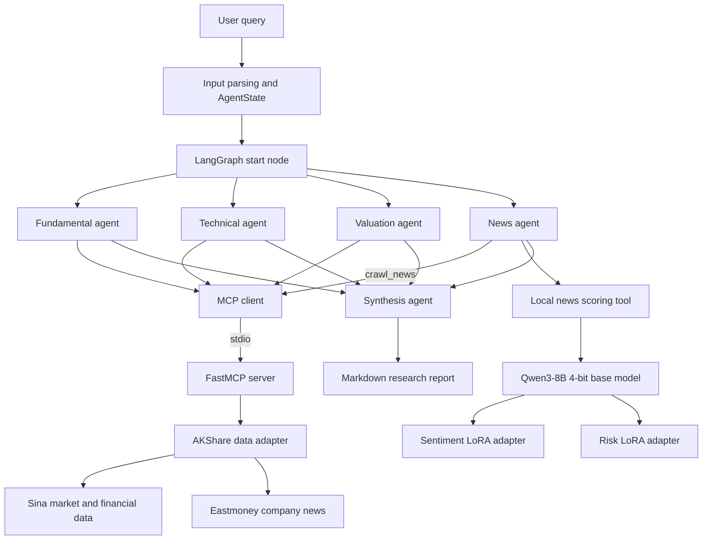

# FinAgent

FinAgent is a multi-agent equity research system built with **LangGraph**, **Model Context Protocol (MCP)**, and **QLoRA**. It decomposes an equity research request into four specialized workflows—fundamental, technical, valuation, and news analysis—and synthesizes their outputs into a structured Markdown report.

> [!IMPORTANT]
> This project is intended for technical learning, data-analysis demonstrations, and secondary development. It does not provide investment advice, return guarantees, or trading recommendations.

## Highlights

- Orchestrates four domain-specific agents and one synthesis agent with a LangGraph state graph.
- Uses ReAct agents to select financial tools and write evidence-backed results to shared state.
- Exposes market data, K-line, financial statement, trading-calendar, and news capabilities through a standalone FastMCP server.
- Integrates Sina Finance and Eastmoney data through an AKShare-based adapter.
- Fine-tunes separate five-level sentiment and risk scorers on Qwen3-8B using 4-bit QLoRA.
- Loads two named LoRA adapters on a single quantized base model and switches adapters at inference time.
- Integrates the local sentiment/risk scorer into the news agent as a LangChain tool.
- Records agent execution, errors, and the final Markdown research report.

## Architecture



### Model Responsibilities

- An OpenAI-compatible LLM performs ReAct tool selection, financial-data interpretation, news summarization, and final report synthesis.
- Qwen3-8B with the sentiment adapter produces a sentiment score from 1 to 5.
- Qwen3-8B with the risk adapter produces a risk score from 1 to 5.
- The two fine-tuned scorers are tools used by the news agent, not standalone agents.

## Repository Layout

```text
Finance/
├─ Financial-MCP-Agent/                # Main LangGraph application
│  ├─ src/main.py                      # Full multi-agent entry point
│  ├─ src/news_only_main.py            # Isolated news-pipeline runner
│  ├─ src/agents/                      # Four analysts and the synthesizer
│  ├─ src/tools/mcp_client.py          # MCP client and shared initialization
│  ├─ src/tools/local_finance_model.py # Dual-adapter scoring tool
│  └─ .env.example                     # Safe configuration template
├─ a-share-mcp-is-just-i-need/         # A-share FastMCP server
│  ├─ mcp_server.py                    # MCP server entry point
│  ├─ src/tools/                       # Financial tool registration
│  └─ src/akshare_sina_data_source.py  # AKShare-backed data adapter
├─ train_qwen_qlora.py                 # Unified QLoRA trainer
├─ evaluate_qwen_qlora.py              # Single-adapter evaluator
├─ run_finance_models.py               # Standalone dual-adapter inference
└─ requirements.txt
```

## End-to-End Workflow

1. The application extracts a company name and stock code from the user request and initializes `AgentState`.
2. LangGraph fans out to the fundamental, technical, valuation, and news agents.
3. Each ReAct agent discovers and invokes the financial tools it needs through the MCP client.
4. The FastMCP server retrieves public data through AKShare and returns normalized tables or news JSON.
5. The news agent fetches up to three articles, summarizes each article, and invokes the local scoring tool.
6. The scorer switches between the sentiment and risk adapters on the same Qwen3-8B base model.
7. The synthesis agent combines all four analyses and writes a structured Markdown report.

## Requirements

- Python 3.10+
- Linux is recommended for QLoRA training and local quantized inference
- NVIDIA GPU with CUDA support for 4-bit training and inference
- An OpenAI-compatible chat-model API for the agent workflow

Agent-only development and tests that do not load the local Qwen model can run on CPU.

## Quick Start

### 1. Install Dependencies

Install a PyTorch build compatible with your CUDA environment first, then install the project dependencies:

```bash
cd Finance
pip install -r requirements.txt
pip install bitsandbytes datasets scikit-learn pandas
```

### 2. Configure Environment Variables

```bash
cd Financial-MCP-Agent
cp .env.example .env
```

Set your API endpoint, model name, base-model path, and adapter paths in `.env`. Never commit `.env` or a real API credential.

### 3. Run the Multi-Agent Workflow

Linux/macOS:

```bash
cd Finance/Financial-MCP-Agent
PYTHONPATH=. python -m src.main --command "分析贵州茅台(600519)"
```

Windows PowerShell 7:

```powershell
Set-Location Finance\Financial-MCP-Agent
$env:PYTHONPATH = "."
python -m src.main --command "分析贵州茅台(600519)"
```

Run only the news pipeline:

```bash
PYTHONPATH=. python -m src.news_only_main \
  --company "贵州茅台" \
  --stock "sh.600519"
```

## Data and Base Model

The training scripts use the following Hugging Face datasets:

- Sentiment scoring: [benstaf/nasdaq_news_sentiment](https://huggingface.co/datasets/benstaf/nasdaq_news_sentiment)
- Risk scoring: [benstaf/risk_nasdaq](https://huggingface.co/datasets/benstaf/risk_nasdaq)

The default base model is Qwen3-8B. Download the model and datasets separately and provide their local paths to the scripts. Model weights, trained adapters, and full datasets are intentionally excluded from this repository.

Core training fields:

| Field | Purpose |
|---|---|
| `Lsa_summary` | Financial-news summary used as model input |
| `Stock_symbol` | Associated stock symbol |
| `sentiment_deepseek` | Sentiment label from 1 to 5 |
| `risk_deepseek` | Risk label from 1 to 5 |

## QLoRA Fine-Tuning

Train the sentiment adapter:

```bash
cd Finance
python train_qwen_qlora.py \
  --task sentiment \
  --model-path ./Qwen3-8B \
  --sampling balanced \
  --max-samples 5000 \
  --epochs 1 \
  --output-dir ./qwen3_8b_sentiment_final
```

Train the risk adapter:

```bash
python train_qwen_qlora.py \
  --task risk \
  --model-path ./Qwen3-8B \
  --sampling balanced \
  --max-samples 2000 \
  --epochs 1 \
  --output-dir ./qwen3_8b_risk_final
```

### Training Configuration

| Parameter | Value |
|---|---|
| Quantization | 4-bit NF4 with double quantization |
| Compute dtype | BF16, with FP16 fallback |
| LoRA rank / alpha / dropout | 16 / 32 / 0.05 |
| Target modules | `q_proj`, `k_proj`, `v_proj`, `o_proj`, `gate_proj`, `up_proj`, `down_proj` |
| Optimizer | `paged_adamw_8bit` |
| Scheduler | Cosine, warm-up ratio 0.03 |
| Default batch size / gradient accumulation | 1 / 8 |
| Default learning rate | 2e-4 |
| Default epochs | 1 |
| Default validation split | 10% |

Training uses a completion-only objective. Prompt and article-summary tokens are masked, so the causal language-modeling loss is computed only on the target score and EOS token.

## Evaluation

```bash
python evaluate_qwen_qlora.py \
  --task sentiment \
  --model-path ./Qwen3-8B \
  --adapter-path ./qwen3_8b_sentiment_final \
  --sampling balanced \
  --max-samples 5000

python evaluate_qwen_qlora.py \
  --task risk \
  --model-path ./Qwen3-8B \
  --adapter-path ./qwen3_8b_risk_final \
  --sampling balanced \
  --max-samples 2000
```

Recorded holdout results:

| Task | Validation samples | Accuracy | Macro-F1 | Within-one-level accuracy |
|---|---:|---:|---:|---:|
| Sentiment | 500 | 0.732 | 0.732 | 96.6% |
| Risk | 200 | 0.670 | 0.700 | 97.0% |

Within-one-level accuracy counts a prediction as acceptable when its distance from the target label is at most one. It is included because the task is ordinal, but it does not replace exact accuracy or Macro-F1.

The holdout split is reconstructed by the evaluation script with the same sampling mode and random seed used during training. It is not an independent external test set. A stronger evaluation would isolate samples by time, stock, or news event.

## Dual-Adapter Inference

```bash
cd Finance
python run_finance_models.py \
  --model-path ./Qwen3-8B \
  --sentiment-adapter ./qwen3_8b_sentiment_final \
  --risk-adapter ./qwen3_8b_risk_final \
  --symbol AAPL \
  --news "Apple reported stronger-than-expected revenue and raised guidance."
```

The inference service loads the 4-bit Qwen3-8B base model once, attaches two named adapters, and uses `set_adapter()` to switch tasks. It extracts the logits of label tokens 1 through 5 at the final sequence position and applies a softmax over those candidates to produce a score and relative distribution.

These values are normalized only across the five candidate labels. They are not calibrated probabilities and should not be interpreted as real-world confidence estimates.

## MCP Tool Layer

The FastMCP server registers 27 tool definitions across market data, financial statements, indices, macroeconomics, trading dates, analysis, and news. Core capabilities verified with the current AKShare adapter include:

- Basic company information and latest quotes
- Daily, weekly, and monthly K-line data
- Income statements, balance sheets, and cash-flow statements
- Multi-period growth, operating-efficiency, and DuPont-related fields
- Trading dates and A-share listings
- Eastmoney company news

Some dividend, index-constituent, macroeconomic, earnings-preview, and related tools return `unavailable` with the current replacement data source. The number of registered tools should therefore not be interpreted as the number of fully supported live-data capabilities.

## Limitations

- Free financial-data endpoints may be rate-limited, disconnected, delayed, or changed without notice.
- Some technical indicators, valuation assessments, and narrative conclusions are inferred by the LLM and do not yet have deterministic numerical validation.
- The fine-tuning datasets primarily contain English-language Nasdaq news, creating language and market-domain shift when scoring Chinese A-share news.
- Extreme risk levels are underrepresented, so minority-class metrics may be unstable.
- The project does not include a backtesting engine; classification metrics do not demonstrate investment profitability.
- Generated reports may contain incorrect or outdated information and must be checked against primary data sources.
- Adapter switching is protected by a lock, so concurrent requests are serialized within one process.

## Security

- Never commit `.env`, API keys, access tokens, or other credentials.
- Do not commit model weights, complete training datasets, runtime logs, or reports containing user queries.
- Revoke and replace any credential that has appeared in plaintext files, terminal output, or shared logs.

## Disclaimer

FinAgent is a research and engineering demonstration. All data and generated content are provided for informational purposes only and may be incomplete, delayed, or incorrect. Users are responsible for independently verifying all information and making their own investment decisions.
