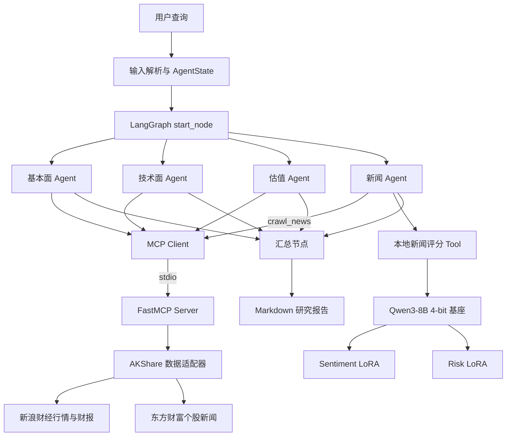

# FinAgent

基于 LangGraph、MCP 与 QLoRA 的多智能体股票投研系统。系统将股票研究拆分为基本面、技术面、估值和新闻分析四类专业 Agent，通过 MCP 统一调用公开金融数据工具，并由汇总节点生成结构化 Markdown 研究报告。

> 本项目用于技术学习、数据分析演示和二次开发，不提供荐股服务，不构成任何投资建议、收益承诺或交易依据。

## 核心能力

- 使用 LangGraph 状态图并行编排基本面、技术面、估值和新闻分析任务。
- 使用 ReAct Agent根据任务自主选择金融工具，并将结果写回共享状态。
- 通过独立 FastMCP Server封装行情、K线、财务报表、交易日和个股新闻等工具。
- 使用 AKShare接入新浪财经行情/财报端点和东方财富个股新闻端点。
- 使用4-bit QLoRA分别微调 Qwen3-8B金融新闻情感、风险五级评分 Adapter。
- 单个4-bit基座同时加载两个命名 LoRA Adapter，按任务动态切换并输出分数及候选概率。
- 将本地评分器封装为 LangChain Tool，接入新闻 Agent的新闻采集、摘要、评分和影响解读流程。
- 保存 Agent执行过程、异常信息和最终 Markdown报告。

## 系统架构



### 模型分工

- OpenAI兼容大模型负责 ReAct工具决策、金融数据解读、新闻摘要和最终报告汇总。
- Qwen3-8B + Sentiment LoRA负责金融新闻情感1—5级评分。
- Qwen3-8B + Risk LoRA负责金融新闻风险1—5级评分。
- 情感和风险模型是新闻 Agent调用的专业评分工具，不是两个独立 Agent。

## 项目结构

```text
Finance/
├─ Financial-MCP-Agent/               # LangGraph 主工程
│  ├─ src/main.py                     # 完整多 Agent入口
│  ├─ src/news_only_main.py           # 新闻链路隔离测试入口
│  ├─ src/agents/                     # 五个分析/汇总节点
│  ├─ src/tools/mcp_client.py         # MCP Client与共享初始化
│  ├─ src/tools/local_finance_model.py# 双 Adapter本地评分工具
│  └─ .env.example                    # 安全配置模板
├─ a-share-mcp-is-just-i-need/        # A股 FastMCP Server
│  ├─ mcp_server.py                   # MCP Server入口
│  ├─ src/tools/                      # 金融工具注册
│  └─ src/akshare_sina_data_source.py # AKShare数据源适配
├─ train_qwen_qlora.py                # 统一 QLoRA训练脚本
├─ evaluate_qwen_qlora.py             # 单 Adapter评测脚本
├─ run_finance_models.py              # 双 Adapter独立推理
└─ requirements.txt
```

## 工作流程

1. 主程序从自然语言中提取公司名称和股票代码，构造 `AgentState`。
2. LangGraph并行调度四个专业分析节点。
3. ReAct Agent通过 MCP Client发现并调用金融工具。
4. FastMCP Server调用 AKShare并将结果转换为 Markdown表格或新闻 JSON。
5. 新闻 Agent抓取最多三条新闻，为每条新闻生成摘要并调用本地评分工具。
6. 本地评分器在同一 Qwen3-8B基座上依次切换情感、风险 Adapter。
7. 汇总节点整合四路分析，生成并保存结构化 Markdown报告。

## 环境准备

建议使用 Linux、Python 3.10和 NVIDIA GPU。QLoRA训练和本地双 Adapter推理需要 CUDA环境；Agent API调用与不加载本地模型的模块测试可在 CPU环境进行。

```bash
cd Finance

# 建议先按照本机CUDA版本安装PyTorch，再安装项目依赖
pip install -r requirements.txt

# QLoRA训练与评测额外依赖
pip install bitsandbytes datasets scikit-learn pandas
```

复制安全配置模板：

```bash
cd Financial-MCP-Agent
cp .env.example .env
```

然后在 `.env` 中填写自己的 API Key、模型名称，以及本地基座和 Adapter路径。不要提交 `.env` 或任何真实密钥。

## 数据集与模型

训练脚本默认使用以下 Hugging Face数据集：

- 情感评分：[benstaf/nasdaq_news_sentiment](https://huggingface.co/datasets/benstaf/nasdaq_news_sentiment)
- 风险评分：[benstaf/risk_nasdaq](https://huggingface.co/datasets/benstaf/risk_nasdaq)

默认基座为 `Qwen3-8B`。请自行下载模型和数据集，并放到本地目录；模型权重、Adapter和完整数据集不包含在 Git仓库中。

训练使用的核心字段：

- `Lsa_summary`：金融新闻摘要；
- `Stock_symbol`：股票代码；
- `sentiment_deepseek`：情感1—5级标签；
- `risk_deepseek`：风险1—5级标签。

## QLoRA训练

情感模型示例：

```bash
cd Finance
python train_qwen_qlora.py \
  --task sentiment \
  --model-path ./Qwen3-8B \
  --sampling balanced \
  --max-samples 5000 \
  --epochs 1 \
  --output-dir ./qwen3_8b_sentiment_final
```

风险模型示例：

```bash
python train_qwen_qlora.py \
  --task risk \
  --model-path ./Qwen3-8B \
  --sampling balanced \
  --max-samples 2000 \
  --epochs 1 \
  --output-dir ./qwen3_8b_risk_final
```

当前脚本的核心默认配置：

| 参数 | 配置 |
|---|---|
| 量化 | 4-bit NF4 + double quant |
| 计算精度 | bf16，GPU不支持时使用fp16 |
| LoRA rank / alpha / dropout | 16 / 32 / 0.05 |
| 目标模块 | q/k/v/o_proj、gate/up/down_proj |
| Optimizer | paged_adamw_8bit |
| Scheduler | cosine，warmup ratio 0.03 |
| 默认batch / 梯度累积 | 1 / 8 |
| 默认学习率 | 2e-4 |
| 默认训练轮数 | 1 |
| 默认验证比例 | 10% |

训练采用 completion-only loss：prompt和新闻摘要对应的 token不参与损失，只在目标分数及 EOS token上计算 CausalLM loss。

## 模型评测

```bash
python evaluate_qwen_qlora.py \
  --task sentiment \
  --model-path ./Qwen3-8B \
  --adapter-path ./qwen3_8b_sentiment_final \
  --sampling balanced \
  --max-samples 5000

python evaluate_qwen_qlora.py \
  --task risk \
  --model-path ./Qwen3-8B \
  --adapter-path ./qwen3_8b_risk_final \
  --sampling balanced \
  --max-samples 2000
```

一次留出验证记录如下：

| 任务 | 验证样本 | Accuracy | Macro-F1 | ±1级容差准确率 |
|---|---:|---:|---:|---:|
| 情感评分 | 500 | 0.732 | 0.732 | 96.6% |
| 风险评分 | 200 | 0.670 | 0.700 | 97.0% |

其中容差准确率表示预测等级与真实等级之差不超过1。该指标由实验混淆矩阵计算，用于补充展示有序五分类的相邻等级误差，不能替代严格 Accuracy与 Macro-F1。

当前验证集由训练脚本按相同采样配置和随机种子重建，不是额外的外部测试集。更严格的评测应使用按时间、股票或新闻事件隔离的外部测试集。

## 双 Adapter推理

```bash
cd Finance
python run_finance_models.py \
  --model-path ./Qwen3-8B \
  --sentiment-adapter ./qwen3_8b_sentiment_final \
  --risk-adapter ./qwen3_8b_risk_final \
  --symbol AAPL \
  --news "Apple reported stronger-than-expected revenue and raised guidance."
```

推理时只加载一次4-bit Qwen3-8B基座，再加载两个命名 Adapter。程序通过 `set_adapter()`依次切换任务，并在最后一个位置的 logits中抽取数字1—5对应 token，经过候选 softmax得到分数和相对概率。

这些概率只在五个候选标签之间归一化，尚未进行概率校准，不应直接解释为真实置信度。

## 运行多 Agent系统

Linux/macOS：

```bash
cd Finance/Financial-MCP-Agent
PYTHONPATH=. python -m src.main --command "分析贵州茅台(600519)"
```

Windows PowerShell：

```powershell
cd Finance\Financial-MCP-Agent
$env:PYTHONPATH = "."
python -m src.main --command "分析贵州茅台(600519)"
```

只测试新闻 Agent：

```bash
PYTHONPATH=. python -m src.news_only_main \
  --company "贵州茅台" \
  --stock "sh.600519"
```

## MCP工具层

MCP Server共注册27个工具定义，覆盖行情、财务、指数、宏观、日期、综合分析和新闻等类别。当前 AKShare替代数据源已验证的核心能力包括：

- 股票基本信息与最新行情；
- 日/周/月历史 K线；
- 利润表、资产负债表和现金流量表；
- 基于多期报表的成长、营运和杜邦相关字段；
- 交易日与全市场股票列表；
- 东方财富个股新闻。

部分分红、指数成分、宏观数据和业绩预告工具在当前替代数据源中会返回 `unavailable`。注册工具数量不代表所有工具当前均有完整数据能力。

## 主要限制

- 免费金融数据接口可能限流、断开连接、变更字段或存在行情延迟。
- 部分技术指标、估值和自然语言结论仍由大模型基于工具结果推断，缺少确定性数值校验。
- 训练数据主要为英文 Nasdaq新闻，应用到中文 A股新闻时存在语言和市场域偏移。
- 风险极端等级样本较少，少数类指标可能存在较大波动。
- 当前没有回测系统，模型分类指标不能证明能够获得投资收益。
- 最终报告可能包含错误或过时信息，必须结合原始数据和人工研究复核。
- 本地评分器通过锁保护 Adapter切换，单进程并发请求会被串行化。

## 安全说明

- 不要提交 `.env`、API Key、访问令牌或任何真实凭据。
- 不要将模型权重、完整训练数据、运行日志或包含用户查询的报告提交到仓库。
- 如果密钥曾以明文保存在文件或终端输出中，应立即在服务商控制台撤销并重新生成。

